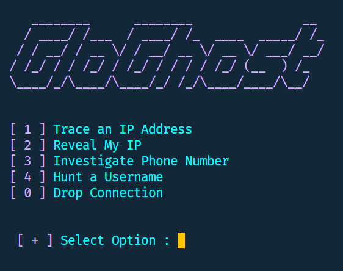
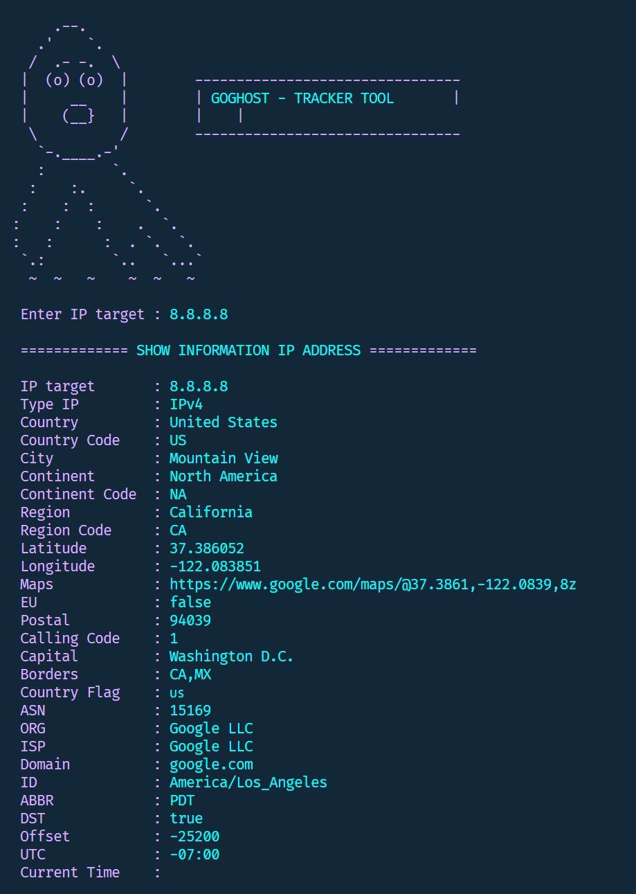
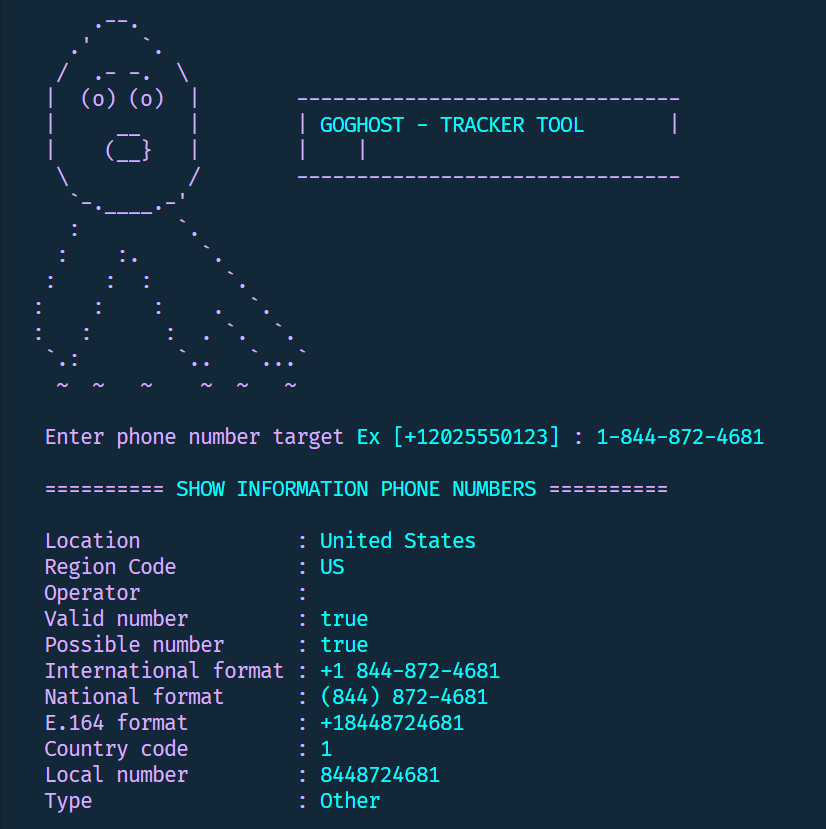
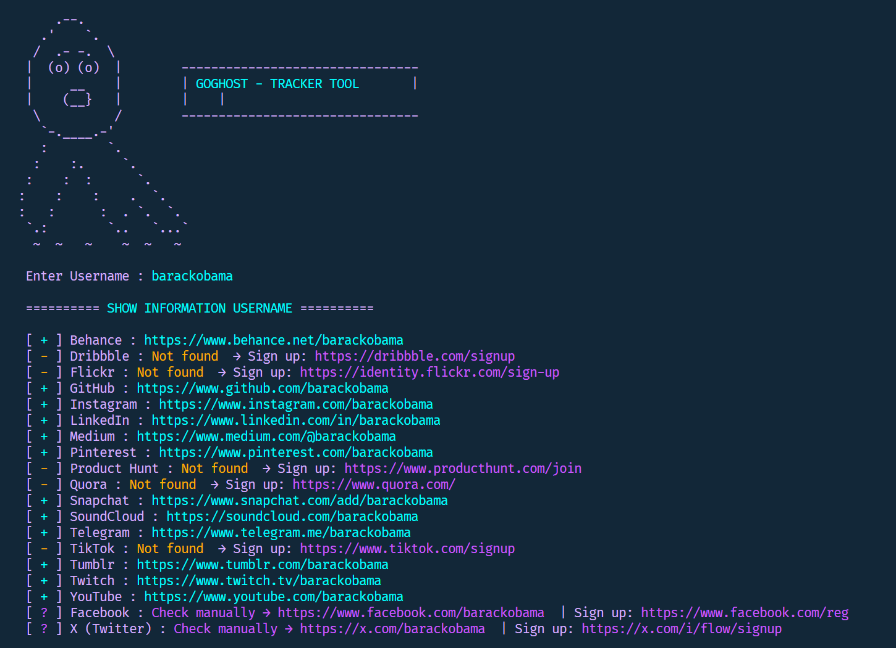

<div align="center">

# 👻 GoGhost

**A fast, single-binary OSINT CLI tool written in Go.**


[](https://golang.org)
[](LICENSE)
[](https://github.com/SubhamSarangi)

</div>

---

## Features

- **IP Tracker** — Full geolocation, ISP, timezone, and map link for any IP address
- **Show Your IP** — Instantly reveals your public IP
- **Phone Number Tracker** — Carrier, region, number type, and all formats via phonenumbers
- **Username Tracker** — Concurrent search across 20 social platforms simultaneously

---

## Preview

| Menu | IP Tracker |
|------|------------|
|  |  |

| Phone Tracker | Username Tracker |
|---------------|-----------------|
|  |  |


---

## Installation

**Requirements:** Go 1.21+

```bash
git clone https://github.com/SubhamSarangi/goghost.git
cd goghost
go mod download github.com/nyaruka/phonenumbers
go mod tidy
```

**Run directly:**
```bash
go run main.go
```

**Build a standalone executable:**
```bash
go build -o goghost.exe main.go   # Windows
go build -o goghost main.go       # Linux / macOS
```

---

## Usage

Launch the tool and select an option from the menu:

```
[ 1 ] IP Tracker
[ 2 ] Show Your IP
[ 3 ] Phone Number Tracker
[ 4 ] Username Tracker
[ 0 ] Exit
```

### IP Tracker
Enter any IPv4 or IPv6 address. Returns country, city, ISP, coordinates, timezone, and a Google Maps link.

### Phone Number Tracker
Enter a number in international format, e.g. `+12025550123`. Returns carrier, region, validity, and all standard formats.

### Username Tracker
Enter a username. GoGhost checks 20 platforms **concurrently** and lists where the account exists.

---

## Project Structure

```
goghost/
├── main.go          # All application logic
├── main_test.go     # Test suite
├── go.mod
├── go.sum
└── assets/          # Screenshots for this README
    ├── banner.png
    ├── menu.png
    ├── ip_tracker.png
    ├── phone.png
    └── username.png
```

---

## Running Tests

```bash
go test ./... -v
```

---

## Dependencies

| Package | Purpose |
|---------|---------|
| [`github.com/nyaruka/phonenumbers`](https://github.com/nyaruka/phonenumbers) | Phone number parsing and formatting |
| Go standard library | Everything else |

---

## APIs Used

| API | Endpoint |
|-----|----------|
| [ipwho.is](https://ipwho.is) | IP geolocation |
| [ipify.org](https://api.ipify.org) | Public IP lookup |

---

## Legal

This tool is intended for **educational and lawful OSINT purposes only**. The author is not responsible for misuse. Always ensure you have permission before investigating any individual or system.

---

<div align="center">

Made with ☕ by [SubhamSarangi](https://github.com/SubhamSarangi)

*If you fork this, a tag back to the original repo would be appreciated.*

</div>
